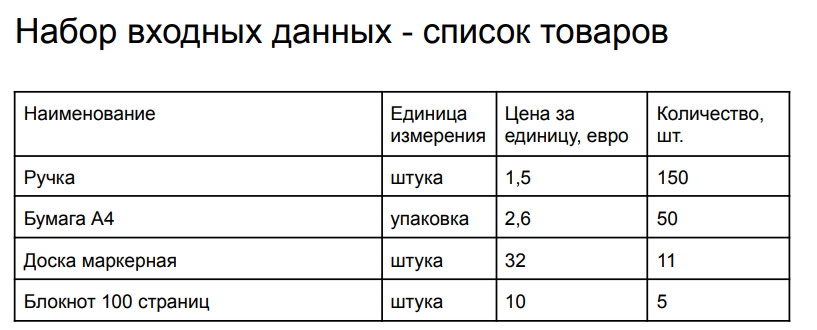
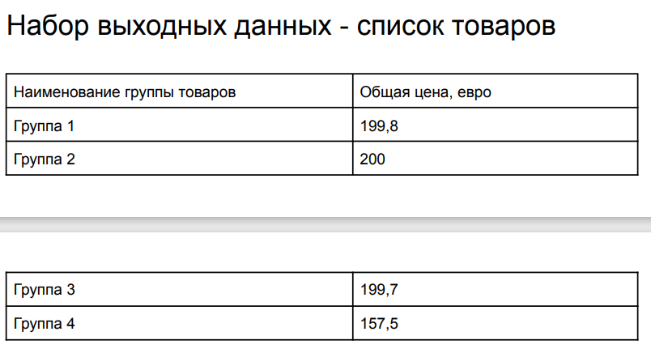
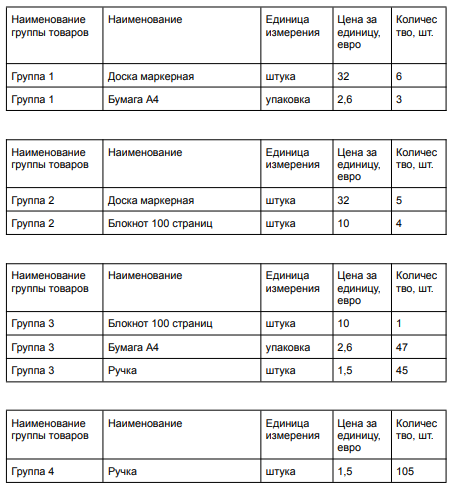

# Тестовое задание. Backend. Middle/Senior

## Цель
Разделение списка товаров на группы товаров с общей ценой, не превышающей 200 евро, при этом
общая цена должна быть как можно близкой к ограничению в 200 евро.

## Описание задачи
Этапы
1. Реализация загрузки списка товаров из документа Excel в приложение
   - a. Реализация endpoint-а для приема файлов с расширением *.xlsx;
   - b. Парсинг данных в класс входных данных;
   - c. Сохранение данных в БД.
2. Реализация сервиса “Разделения списка товаров на группы товаров”
   - a. Получение данных из БД
   - b. Реализация логики разделения списка товаров на группы товаров
     - i. общая цена группы товаров, не должна превышать 200 евро
     - ii. общая цена должна быть как можно близкой к ограничению в 200 евро
   - c. Обновление статуса товаров, для исключения их повторной обработки
   - d. Сохранение группы товаров в БД
3. Реализация Task Manager для запуска сервиса “Разделения списка товаров на группы
   товаров”
   - a. Запуск по интервалу времени - 5 минут
4. Реализация отображения группы товаров
   - a. Реализация endpoint-а для получения списка групп товаров
   - b. Реализация endpoint-а для получения списка товаров по идентификатору группы

## Пример

\

\


## Требования

- .NET 8
- ASP.NET Runtime

## Запуск

1. Склонировать репозиторий
2. Открыть проект
3. Запустить скрипт для создания БД

   ```bash
   dotnet ef database update
   ```

4. Запустить проект

   ```bash
   dotnet run
   ```

5. Перейти по адресу `http://localhost:5293/swagger`

## Дополнительно

### Описание

- В качестве БД используется SQLite, чтобы ничего не разворачивать
- Для загрузки Excel используется ExcelDataReader, так как он не требует установки Excel на сервере и лицензия позволяет коммерческое использование (MIT).
- Для управления задачами используется Hangfire, просто и удобно, вместо Quartz и BackgroundService.
- FastEndpoints как альтернатива CQRS, к тому же AoT компиляция.
- Mediatr для уведомлений, чтобы не использовать события.
- InMemory кэширование для статуса файлов. Лучше Redis, но мне лень.

### Использованные библиотеки

- [FastEndpoints](https://fast-endpoints.com/)
- [ExcelDataReader](https://github.com/ExcelDataReader/ExcelDataReader)
- [Hangfire](https://www.hangfire.io/)
- [Mediatr](https://github.com/jbogard/MediatR) (Только Notification)
- EF Core

### Решение

Обсуждение при собеседовании.
